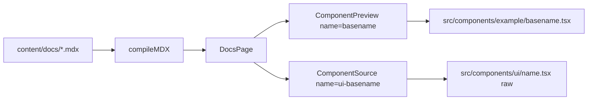

# Component documentation (shadcn-style + Ark UI)

## Current wiring (what you already have)

- **MDX**: [`content-collections.ts`](content-collections.ts) compiles [`content/docs/**/*.mdx`](content/docs/) with GFM + pretty code.
- **Live previews**: [`ComponentPreview`](src/components/component-preview.tsx) resolves `name` to **`src/components/example/<name>.tsx`** via globs in [`src/lib/component-example-modules.ts`](src/lib/component-example-modules.ts) (default export + raw source for the Code tab).
- **MDX components**: [`docs-page.tsx`](src/components/docs/docs-page.tsx) passes `{ ComponentPreview, PackageInstall }` into `MDXContent` only—**Installation** will require registering **`Tabs`**, **`ComponentSource`**, and a **docs-only Steps/Step** (see below).

## Gaps vs your target template

| Item | Status |
| ---- | ------ |
| Full sections (Usage, Examples, API Reference) | Accordion MDX is minimal ([`content/docs/component/accordion.mdx`](content/docs/component/accordion.mdx)). |
| `align="start"` on `ComponentPreview` | **Not implemented**—[`ComponentPreviewProps`](src/components/component-preview.tsx) has no `align`; preview panel uses fixed centering classes (`justify-center`). |
| “Base UI” wording in your sample | **Incorrect for this repo**—[`accordion.tsx`](src/components/ui/accordion.tsx) wraps **`@ark-ui/react/accordion`**, not Base UI. Docs should say **Ark UI** and link to [Ark Accordion docs](https://ark-ui.com/react/docs/components/accordion) for full prop tables. |
| `AccordionContent` in API text | **Not exported** today—only `AccordionPanel` (and `AccordionContext`, `AccordionProvider`, `useAccordion`). Either document `AccordionPanel` only or add a **shadcn-parity alias** `export { AccordionPanel as AccordionContent }` in the UI file. |
| Examples `p-accordion-2` etc. | **No matches** in the repo—those names were illustrative. Use **kebab-case basenames** that match files under `example/`, e.g. `accordion-demo`, `accordion-single`, `accordion-multiple`, `accordion-controlled`. |
| Showcase as source of truth | **Only** [`ark-ui-showcase.tsx`](src/components/ark-ui-showcase.tsx) contains Accordion (~line 6792). **`ark-ui-showcase-1/2/3.tsx` have no Accordion**—you cannot “extract from all four” for accordion variants; author additional demos from Ark patterns + the existing showcase snippet. |
| Frontmatter `id` uniqueness | [`content/docs/component.mdx`](content/docs/component.mdx) and [`content/docs/component/accordion.mdx`](content/docs/component/accordion.mdx) both use **`id: 3`**, which affects [`docs-sidebar`](src/components/docs/docs-sidebar.tsx) sort order. New pages should get **unique** `id` values. |
| **Installation** section | Not in current pages—add **before Usage**: CLI vs Manual tabs, `PackageInstall`, and full **component source** for copy-paste. |

## `ComponentSource` (new)

Goal: match the **shadcn-style** block in your reference (dark panel, **header** with language badge + **display path** + **Expand** + **Copy**, **line numbers**, **truncated height** with fade + expand to show full [`src/components/ui/<name>.tsx`](src/components/ui/accordion.tsx) source).

- **Implementation** (recommended split):
  - Extract shared **Shiki highlighting** used by [`ComponentPreviewHighlightedCode`](src/components/component-preview.tsx) into a small shared helper or export the existing inner component so `ComponentSource` does not duplicate `codeToHtml` + theme wiring ([`DOCS_CODE_THEMES`](src/lib/docs-code-theme.ts)).
  - Add [`src/components/component-source.tsx`](src/components/component-source.tsx) (or co-locate under `docs/`) with props such as:
    - `name` — basename of the UI file (e.g. `"accordion"` → resolve `src/components/ui/accordion.tsx` via **`import.meta.glob`** + `?raw`, parallel to [`component-example-modules.ts`](src/lib/component-example-modules.ts) but targeting **`../components/ui/*.tsx`**).
    - `title` — optional override for the path string shown in the header (e.g. `components/ui/accordion.tsx`); default derived from `name`.
  - **Line numbers**: either post-process Shiki output (wrap lines) or use CSS `counter` / grid with split columns; Shiki’s `lineNumbers` transformer is an option if you add it to the pipeline.
  - **Expand**: local state toggling `max-height` / `overflow` and optional “Show less”; mirror header and footer **Expand** controls from the mockup.
  - **Copy**: reuse [`ClipboardRoot`](src/components/ui/clipboard.tsx) like `ComponentPreview` does.

## Installation section (MDX template, before Usage)

Target structure (conceptual—**adjust names to this repo’s exports**):

- **`Tabs`** with two panels: **CLI** | **Manual**.
- **CLI panel**: `<PackageInstall pkg="…" shadcn />` — [`PackageInstall`](src/components/package-install.tsx) already supports `shadcn` and emits `pnpm dlx shadcn@latest add …` / `npx` / `bunx` lines.
- **Manual panel**: numbered instructions + `@ark-ui/react` install + `<ComponentSource name="accordion" title="components/ui/accordion.tsx" />` + note to fix imports.

**Corrections vs your draft snippet:**

- This codebase uses **`TabsTrigger`** and **`TabsContent`**, not `TabsTab` / `TabsPanel` (see [`tabs.tsx`](src/components/ui/tabs.tsx)). MDX should use those names (or add thin aliases `TabsTab` → `TabsTrigger` if you insist on shadcn naming).
- Close with **`</Tabs>`**, not `</CodeTabs>` (unless you introduce a `CodeTabs` wrapper component).
- **`Steps` / `Step`**: [`src/components/ui/steps.tsx`](src/components/ui/steps.tsx) is Ark’s **multi-step wizard**, not an ordered install list. Add **separate** docs primitives, e.g. `InstallSteps` + `InstallStep` or `DocStep` + `DocSteps`, implemented as a simple numbered list / vertical steps UI for MDX only—so manual install reads like shadcn without misusing the wizard component.
- **Package name / registry**: Scope is **accordion first**. When adding each component, **manually register** it (see [`registry.json`](registry.json) / shadcn CLI layout), then run **`bun registry:build`** ([`package.json`](package.json) — `shadcn build`). The CLI tab’s `pkg` should match whatever the registry exposes for `shadcn add …` (fix spelling: **accordion**, not “accordian”).

## Recommended doc page shape (repeatable)

For each component, use one MDX file under `content/docs/...` with:

1. **Frontmatter** — `id` (unique), `title`, `description`, `url` (matches loader in [`src/routes/_docsLayout/docs/$.tsx`](src/routes/_docsLayout/docs/$)), optional **`referenceLink`** (Ark docs URL for header “API” button and in-page deep links; see [`content-collections.ts`](content-collections.ts) schema).
2. **Intro** — Short paragraph (optional).
3. **Main demo** — `<ComponentPreview name="<component>-demo" />` (or `align="start"` once supported).
4. **Installation** — Tabs (CLI / Manual) as above; Manual includes `ComponentSource` for the `ui/<component>.tsx` file.
5. **Usage** — Import block + minimal composition (fenced `tsx` blocks; prose styling already supports this).
6. **Examples** — One `ComponentPreview` per variant; each variant = one file in [`src/components/example/`](src/components/example/).
7. **API reference** — **Do not** restate Ark’s prop lists in MDX (no per-part bullet lists of `multiple`, `value`, etc.). One short intro: exports map to **`@ark-ui/react/…`** and TypeScript / Ark docs are source of truth. **Only document props that are *not* on the upstream Ark primitive** (e.g. **`indicator`** on `AccordionTrigger`), in a **`DocPropsTable`** under a heading like **`### Props not in Ark UI`** (or **`### ark-cn only`**). Optional one-line notes for repo-only **behavior** (e.g. where `className` lands) without duplicating Ark. Link out: “See the [ARK UI documentation](https://ark-ui.com/docs/components/…) for the full API” using **`referenceLink`**. Optional: **`DataAttributesTable`** only when this repo adds meaningful **`data-slot`** / selectors worth documenting separately from Ark (otherwise skip—Ark’s attribute tables stay on Ark’s site). Presets like [`accordion-doc-supplement.tsx`](src/components/docs/presets/accordion-doc-supplement.tsx) should only bundle **extension props** + **keyboard** (or other MDX-heavy blocks), not full Ark API copies.
8. **Accessibility** (when the primitive has a11y docs) — keep this section short. Add **`## Accessibility`** with a brief sentence, then link out with wording like: “See the [ARK UI documentation](https://ark-ui.com/docs/components/accordion#accessibility) for clarification.” Use **`### Keyboard support`** and **`KeyboardShortcutsTable`** ([`docs-keyboard-shortcuts-table.tsx`](src/components/docs/docs-keyboard-shortcuts-table.tsx)) only when a concise keyboard summary adds value; otherwise prefer the Ark UI accessibility link over copying large interaction tables. Register new MDX components in [`docs-page.tsx`](src/components/docs/docs-page.tsx).

## “Automatic” API Reference (pragmatic)

Full prop extraction from `@ark-ui/react` into MDX is possible but heavy (typedoc, react-docgen-typescript, or maintaining generated tables). A **sustainable** approach for this codebase:

1. **Convention**: Each `src/components/ui/<component>.tsx` uses a single import alias pattern (e.g. `AccordionPrimitive` from `@ark-ui/react/accordion`).
2. **Light automation (optional)**: A small **Bun script** that, per file:
   - Lists `export const Foo` / `export { ... }`.
   - Regex or simple AST: maps `AccordionPrimitive.Root` → `Root`, `ItemTrigger` → `ItemTrigger`, etc.
   - Outputs a **Markdown snippet** or JSON used to scaffold the API section (human edits descriptions).
3. **Always** link to Ark’s official docs for the full prop list; the MDX layer describes **this repo’s** wrappers (extra `className`, `cn`, custom slots, re-exports).

This matches “analyse primitive” without maintaining duplicate type tables by hand.

## Accordion reference implementation (concrete steps)

1. **Fix doc ordering** — Assign Accordion (and parent “Components” hub if kept) **distinct `id`** values so the sidebar order is stable.
2. **Extend `ComponentPreview`** — Add optional `align?: "start" | "center" | "end"` (or similar) and map it to Tailwind on the preview panel wrapper (replacing or overriding `justify-center` from [`previewPanelClass`](src/components/component-preview.tsx)).
3. **Example files** in [`src/components/example/`](src/components/example/):
   - **`accordion-demo.tsx`** — overview.
   - **`accordion-single.tsx`**, **`accordion-multiple.tsx`**, **`accordion-controlled.tsx`** — core modes.
   - **`accordion-horizontal.tsx`** — `orientation="horizontal"`.
   - **`accordion-lazy.tsx`** — `lazyMount` + `unmountOnExit`.
   - **`accordion-custom-indicator.tsx`** — **`indicator`** (ark-cn-only prop).
   - Align copy with [`accordion.tsx`](src/components/ui/accordion.tsx) exports.
4. **Expand [`accordion.mdx`](content/docs/component/accordion.mdx)** — **Installation** (Tabs + PackageInstall + ComponentSource + doc Steps), Usage blocks, Examples with `<ComponentPreview name="accordion-single" align="start" />` (etc.), API Reference subsections with **Ark UI** primitive names (`Root`, `Item`, `ItemTrigger`, `ItemContent`, `ItemIndicator`, `Context`, `RootProvider`).
5. **Optional parity** — If you want shadcn-style `AccordionContent` in docs, add the **`AccordionContent` alias export** in the UI file; otherwise remove it from the written API section.

## Scaling to other components (~64 under [`src/components/ui/`](src/components/ui/))

- **Do not** copy entire showcase files into MDX; **lift** only the relevant `DemoCard` / section into a **focused** `example/<name>-<variant>.tsx`.
- **One MDX page per component** (or per family if you later group small primitives), each following the same section order.
- Re-run the optional scaffold script when adding a new `ui/*.tsx` to generate a first-pass API outline.

## Files likely touched

| Area | Files |
| ---- | ----- |
| ComponentSource + UI raw glob | New [`src/lib/component-ui-modules.ts`](src/lib/component-ui-modules.ts) (or similar), [`src/components/component-source.tsx`](src/components/component-source.tsx); optional Shiki helper extracted from [`component-preview.tsx`](src/components/component-preview.tsx) |
| MDX registry | [`src/components/docs/docs-page.tsx`](src/components/docs/docs-page.tsx) — pass `Tabs*`, `ComponentSource`, `PackageInstall`, doc `Step`/`Steps`, **`DocPropsTable`**, **`DataAttributesTable`**, **`KeyboardShortcutsTable`**, optional preset supplements |
| Doc API / a11y tables | [`src/components/docs/docs-props-table.tsx`](src/components/docs/docs-props-table.tsx), [`docs-data-attributes-table.tsx`](src/components/docs/docs-data-attributes-table.tsx), [`docs-keyboard-shortcuts-table.tsx`](src/components/docs/docs-keyboard-shortcuts-table.tsx), [`presets/`](src/components/docs/presets/) |
| Doc-only Steps | New under e.g. [`src/components/docs/`](src/components/docs/) |
| Preview API | [`src/components/component-preview.tsx`](src/components/component-preview.tsx) |
| Examples | [`src/components/example/*.tsx`](src/components/example/) (new + existing accordion) |
| Accordion UI (optional alias) | [`src/components/ui/accordion.tsx`](src/components/ui/accordion.tsx) |
| Docs | [`content/docs/component/accordion.mdx`](content/docs/component/accordion.mdx), possibly [`content/docs/component.mdx`](content/docs/component.mdx) / ids |
| Automation (optional) | New script under e.g. `scripts/` + `package.json` script entry |
